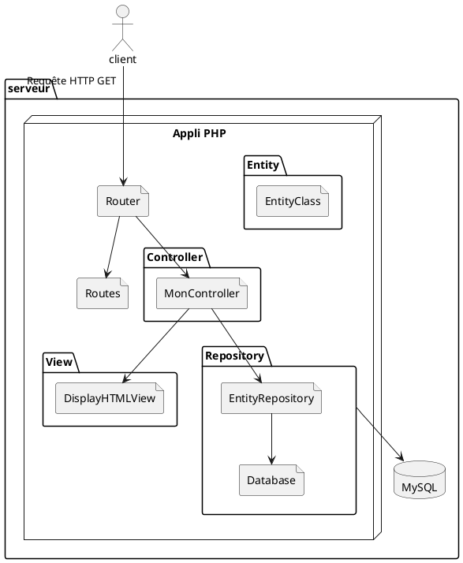

# php-mvc-base

Projet à cloner ou mieux, à fork, pour partir une base MVC From Scratch sur ses projets PHP sans framework


## How To Use
1. Faire une fork du projet (ou bien le cloner et changer le repo distant avec `git remote set-url origin url-de-votre-git-à-vous`)
2. Cloner le projet
3. Faire un `composer install`
4. Créer un fichier `.env` à la racine du projet avec la structure ci dessous, en remplaçant les valeurs nécessaire selon votre configuration
5. Lancer le projet 

.env
```
DB_HOST=localhost
DB_USER=dev
DB_PASSWORD=1234
DB_PORT=3306
DB_NAME=hb_first
```

## Utilisation du MVC

### Créer une nouvelle page
1. On crée un contrôleur dans le dossier `src/Controller` qui va hériter de la classe `App\Core\BaseController`
2. On crée une ou plusieurs View dans le dossier `src/View` qui va hériter de la classe `App\Core\BaseView` et dans laquelle on crée une méthode protecte function content. C'est dans cette méthode qu'on met le HTML de la page en question
3. On vient modifier le fichier `src/Routes.php` pour rajouter dans le tableau de routes un nouveau chemin qu'on lie à une instance du contrôleur qu'on a fait à l'étape 1
4. Dans le contrôleur, on redéfinit la méthode doGet et/ou doPost (selon si ce formulaire ne fait que de l'affichage ou que du traitement de formulaire ou les deux) et on lui fait return une instance de la View qu'on a créée
5. Si notre View a besoin de data, on les met en propriétés de la classe et on fait en sorte de pouvoir les fournir via le constructeur. Côté contrôleur, au moment d'instancier, on récupère les données nécessaire d'une manière ou d'une autre (un appel à un repository par exemple) et on les donne à notre View

#### Classes utilitaires
* [App\View\RedirectView](src/View/RedirectView.php) : Permet de faire une redirection vers une autre page depuis le contrôleur lorsqu'on le return, il attend en argument d'instance le lien vers lequel redirigé
* [App\View\ErrorView](src/View/ErrorView.php) : Une page d'erreur standard qui permettra d'afficher des erreurs à l'utilisateur⋅ice (les 404 par exemple)
* [App\View\Part\Header](src/View/Part/Header.php) et [App\View\Part\Footer](src/View/Part/Footer.php) : Sont utilisées par la BaseView pour afficher un header et un footer commun à toutes les pages, elles contiennent également l'ouverture et la fermeture des balises HTML (c'est dans le header qu'on viendra charger des styles par exemple). À noter que le Header possède une variable static `Header::$pageTitle` servant à modifier le titre et pouvant être redéfinie depuis les contrôleurs ou ailleurs.

#### Notes
* Si une View a besoin de données à afficher, on lui met en propriété private avec un constructeur pour les assigner. C'est le contrôleur qui récupérera les données et les donnera à la vue.
* Si une page affichage un formulaire, à moins qu'il s'agisse d'un formulaire de recherche, celui ci sera en post, si le contrôleur gère autant l'affichage que le traitement alors il devra avoir un doGet pour juste afficher le formulaire et un doPost pour traiter son submit


## Explications du MVC
L'idée générale est d'avoir une bonne séparation entre les principes de l'application : le modèle pour les données et leur manipulation, la vue pour l'affichage et le contrôleur pour traiter les requêtes et orchestrer les deux autres.



**Explication du schéma**
* Un client fait une requête HTTP vers le serveur (par exemple http://serveur.com/test)
* Le index.php intercepte la requête et la fait suivre au composant Router
    * Le Router possède une liste de routes qui sont en fait une association entre un chemin (par exemple "/test") et une instance de contrôleur
    * Le Router regarde dans sa liste de route si une correspond à la requête (si non, on renvoie une page 404)
    * Le Router exécute la méthode du contrôleur correspondant à la route donné, cette méthode partira sur un doGet ou un doPost selon si la requête HTTP est en GET ou en POST
* Le contrôleur utilise le Repository pour aller récupérer les données
    * Le Repository utilise un composant Database pour faire une connexion à la base de données
    * Les informations de connexion sont récupérées des variables d'environnement grâce à library PhpDotEnv
    * Le Repository fait la requête nécessaire vers la base de données (dans notre cas en MySQL)
    * Il fait des instances d'entités à partir des résultat dans le cas d'une lecture ou au contraire fait une requête  à partir d'une instance d'entité
* Le contrôleur crée une instance de la vue à renvoyer en lui donnant en paramètres les données nécessaires à l'affichage, souvent provenant de la base de données
* La vue utilise les données fournies par le contrôleur pour générer l'affichage HTML