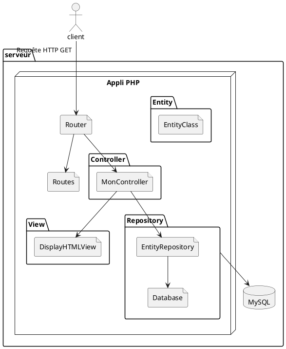

# php-mvc-base

Projet à cloner ou mieux, à fork, pour partir une base MVC From Scratch sur ses projets PHP sans framework


## How To Use
1. Faire une fork du projet (ou bien le cloner et changer le repo distant avec `git remote set-url origin url-de-votre-git-à-vous`)
2. Cloner le projet
3. Faire un `composer install`
4. Créer un fichier `.env` à la racine du projet avec la structure ci dessous, en remplaçant les valeurs nécessaire selon votre configuration
5. Lancer le projet 

.env
```
DB_HOST=localhost
DB_USER=dev
DB_PASSWORD=1234
DB_PORT=3306
DB_NAME=hb_first
```

## Utilisation du MVC

### Créer une nouvelle page
1. On crée un contrôleur dans le dossier `src/Controller` qui va hériter de la classe `App\Core\BaseController`
2. On crée une ou plusieurs View dans le dossier `src/View` qui va hériter de la classe `App\Core\BaseView` et dans laquelle on crée une méthode protecte function content. C'est dans cette méthode qu'on met le HTML de la page en question
3. On vient modifier le fichier `src/Routes.php` pour rajouter dans le tableau de routes un nouveau chemin qu'on lie à une instance du contrôleur qu'on a fait à l'étape 1
4. Dans le contrôleur, on redéfinit la méthode doGet et/ou doPost (selon si ce formulaire ne fait que de l'affichage ou que du traitement de formulaire ou les deux) et on lui fait return une instance de la View qu'on a créée
5. Si notre View a besoin de data, on les met en propriétés de la classe et on fait en sorte de pouvoir les fournir via le constructeur. Côté contrôleur, au moment d'instancier, on récupère les données nécessaire d'une manière ou d'une autre (un appel à un repository par exemple) et on les donne à notre View


## Explications du MVC
L'idée générale est d'avoir une bonne séparation entre les principes de l'application : le modèle pour les données et leur manipulation, la vue pour l'affichage et le contrôleur pour traiter les requêtes et orchestrer les deux autres.




Un client fait une requête HTTP vers le serveur